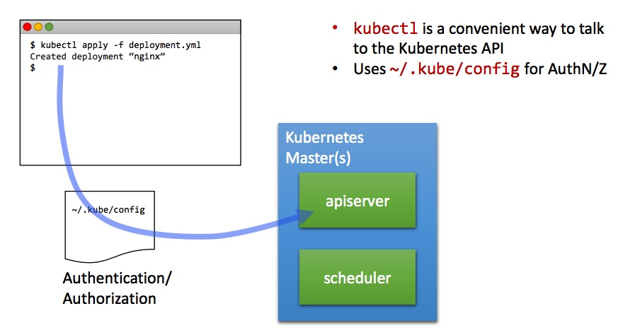

## Kubectl



Kubectl will translate any commands to REST API calls to the Kubernetes API server.

Kubectl will use `~/.kube/config` as a configuration file, or whatever is pointed to by environment variable `KUBECONFIG`.

[Reference documentation](https://kubernetes.io/docs/reference/kubectl/kubectl/)


## Working with contexts

```
# Show Merged kubeconfig settings.
$ kubectl config view

# Display the current-context
$ kubectl config current-context

# Set the default context to my-cluster-name
$ kubectl config use-context my-cluster-name  

# To add a new cluster/context/user see examples from help for each command (different authentication methods available)
$ kubectl config set-cluster  --help
$ kubectl config set-credentials --help
$ kubectl config set-context --help
```

Alternative to merging all cluster information into one config is to use separate configs and use all at the same time or just one at a time:
```
# use single kubeconfig file
$ export KUBECONFIG=~/.kube/kubconfig2

# use multiple kubeconfig files at the same time and view merged config
$ KUBECONFIG=~/.kube/config:~/.kube/kubconfig2 kubectl config view
```