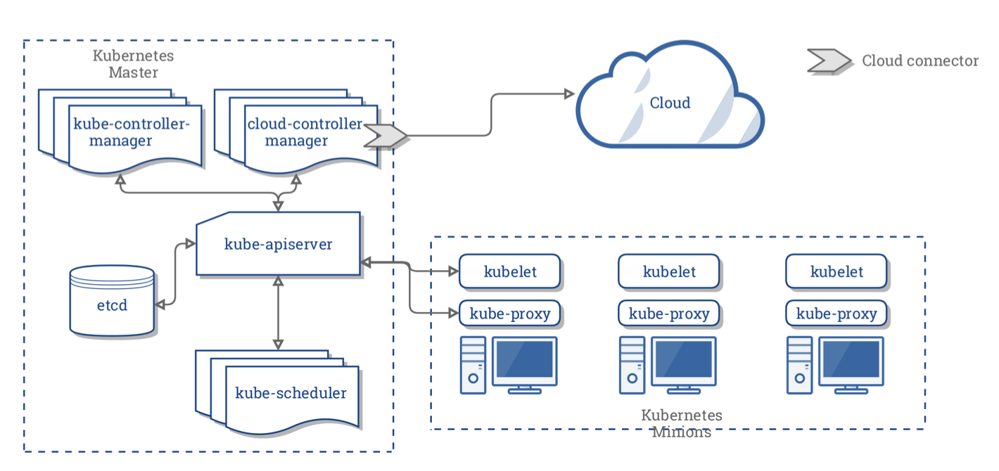
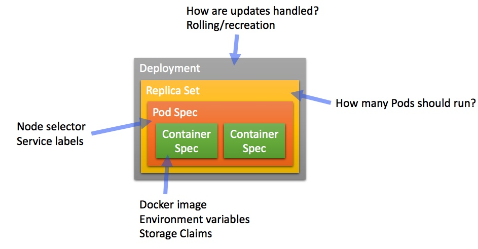
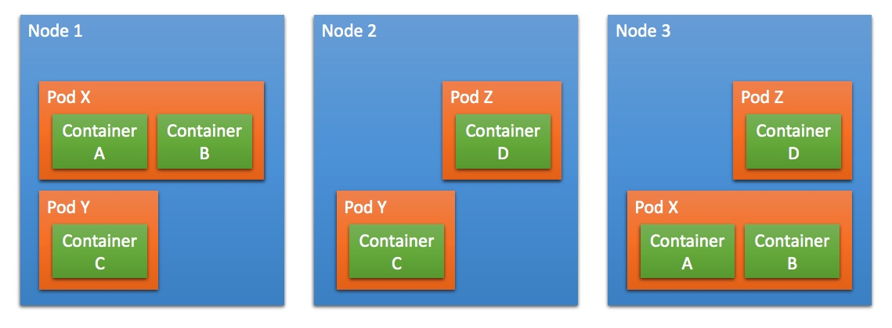
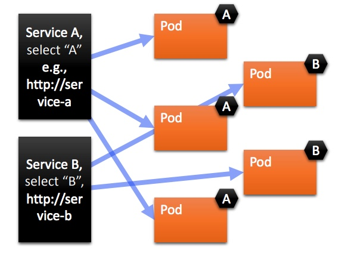

## Kubernetes Architecture

Kubernetes is made of a central manager (master) and some worker nodes (here called minions).

Master runs
* **API server**: exposes the API with which you can communicate via kubectl
* **Scheduler**: kube-scheduler sees the requests for running containers coming from the API and finds a suitable node to run them
* Various **controllers**
* A **storage system** (etcd) to keep the state of the cluster, container settings and network configuration

Nodes run:
* **Kubelet**: received requests to run the containers, manages any necessary resources and watches them on the local node
* **Kube-proxy**: creates and manages networking rules to expose the container over the network

## What does Kubernetes do?
* Provide a runtime environment for Docker containers
* Scale and load balance docker containers
* Abstract away the infrastructure containers run on
* Monitor/health check containers
* Declarative definition for running containers
* Update containers (also rolling updates)
* Storage mounting (allow abstracting infrastructure)
* Service discovery and exposure
* Labelling and selection of any kind of object

## Abstractions

### "Boxes in boxes"

**Pods** are the smallest deployable units of computing that can be created and managed in Kubernetes.

Pods consist of one or more containers which share IP address, access to storage and namespace. Typically, one container inside a pod runs an application, while others support the primary application. You can add **labels** (key-value pairs), which become part of the object metadata, and are used to select and filter pods.

Orchestration in k8s is managed through a series of watch-loops called **controllers**. Each controller interrogates the kube-apiserver for a particular object state, modifying the object until it matches the declared state.

The **replica set** is a controller which deploys an restarts pods, until the the requested number of pods is running. 

The **deployment** ensures that resources are available, such as storage and IP address and deploys a replica set. The deployment specifies how updates to the replica set are handled. 

#### Kubernetes runtime

### Services

A **service** provides a way to refer to a set of Pods (selected by labels) with a single static IP address. It may also provide load balancing, if supported by the provider.

